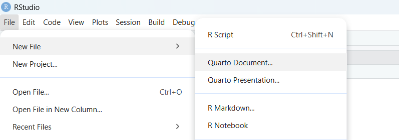

::: {.columns #catedra}

::: {.column .clase-main}

```{=html}
<section class="clase-hero">
  <p class="clase-kicker">Clase 06</p>
  <h1>Documentos dinámicos en Quarto</h1>
  <p>Cómo construir un informe reproducible con texto, código, tablas, gráficos e interpretaciones.</p>
</section>
```

::: {.clase-card .clase-intro}

## Contenidos de la clase

En esta clase aprenderemos a construir un informe simple en **Quarto**. La idea es que puedan crear un archivo `.qmd`, escribir texto, ejecutar código de R, generar tablas, hacer gráficos e interpretar resultados.

Trabajaremos con una base ficticia sobre bienestar subjetivo, confianza institucional y participación social. El foco no está en obtener resultados reales, sino en aprender una forma ordenada y reproducible de construir informes.

::: {.clase-objetivos}

::: {.objetivo-card}
**Quarto**

Entender qué es un archivo `.qmd` y cómo se renderiza a HTML.
:::

::: {.objetivo-card}
**Código R**

Usar chunks para ejecutar código dentro del documento.
:::

::: {.objetivo-card}
**Tablas**

Construir tablas simples con `dplyr` y `gt`.
:::

::: {.objetivo-card}
**Gráficos**

Crear gráficos básicos con `ggplot2`.
:::

::: {.objetivo-card}
**Interpretación**

Escribir comentarios breves después de cada tabla o gráfico.
:::

:::

:::

::: {.clase-card}

## 1. ¿Qué es Quarto?

Quarto permite crear documentos dinámicos. En un mismo archivo podemos combinar:

| Elemento | Para qué sirve |
|---|---|
| YAML | Define título, autoría y formato de salida |
| Markdown | Permite escribir texto, títulos y listas |
| Chunks de R | Permiten ejecutar código, tablas y gráficos |

La lógica general es:

```text
archivo .qmd  →  Render  →  archivo .html
```

El archivo `.qmd` es el documento editable. El archivo `.html` es el resultado final que se abre en el navegador.

::: {.callout-note}
La ventaja de Quarto es que no necesitamos copiar y pegar resultados desde R. Las tablas y gráficos se generan dentro del mismo informe.
:::

:::

::: {.clase-card}

## 2. ¿Qué vamos a construir?

En esta clase construiremos un informe llamado:

```text
informe_practica_bienestar.qmd
```

El informe responderá esta pregunta ficticia:

> ¿Cómo se distribuye el bienestar subjetivo según sexo, edad, nivel educacional y participación social en una encuesta ficticia de población adulta?

El informe tendrá solo lo esencial:

- una introducción breve;
- una base de datos simulada;
- una definición simple de variables;
- una tabla de frecuencia;
- una tabla descriptiva;
- un gráfico de barras;
- un histograma;
- una tabla bivariada;
- un boxplot;
- una conclusión breve.

:::

::: {.clase-card}

## 3. Crear el archivo del informe

En RStudio:

1. Ir a **File > New File > Quarto Document**.
2. Elegir salida **HTML**.
3. Guardar el archivo como `informe_practica_bienestar.qmd`.
4. Borrar el contenido inicial.
5. Copiar los bloques siguientes en orden.



:::

::: {.clase-card}

## 4. Bloque 0: YAML del informe

Este bloque va al inicio del archivo `informe_practica_bienestar.qmd`.

````markdown
---
title: "Informe de práctica: bienestar subjetivo"
author: "Nombre Apellido"
date: today
lang: es
format:
  html:
    toc: true
    toc-depth: 2
    number-sections: true
    theme: cosmo
    code-fold: true
    code-summary: "Mostrar código"
execute:
  warning: false
  message: false
---
````

Reemplacen `Nombre Apellido` por su nombre.

:::

::: {.clase-card}

## 5. Bloque 1: Introducción

Copia este bloque después del YAML.

````markdown
# Introducción

Este informe utiliza una base de datos ficticia para practicar la construcción de un documento reproducible en Quarto. El objetivo no es representar una población real, sino aprender a integrar texto, código, tablas, gráficos e interpretaciones en un mismo archivo.

El tema del informe es el bienestar subjetivo. Para practicar análisis descriptivo, se trabajará con variables como sexo, edad, nivel educacional, participación social, confianza institucional e ingreso.

**Pregunta de investigación:** ¿Cómo se distribuye el bienestar subjetivo según sexo, edad, nivel educacional y participación social en una encuesta ficticia de población adulta?

**Objetivo:** Describir la distribución del bienestar subjetivo y compararla según algunas características sociales básicas.
````

:::

::: {.clase-card}

## 6. Bloque 2: Cargar paquetes

Este bloque carga los paquetes que usaremos. Debe ir antes de crear tablas y gráficos.

````markdown
# Preparación de los datos

## Cargar paquetes

```{r}
#| label: cargar-paquetes-ejemplo

# Instalamos pacman si no está instalado
if (!requireNamespace("pacman", quietly = TRUE)) {
  install.packages("pacman")
}

# Cargamos paquetes
pacman::p_load(
  tidyverse, # manipular datos y hacer gráficos
  gt         # hacer tablas más bonitas
)

# Evitamos notación científica
options(scipen = 999)
```
````

::: {.callout-note}
`tidyverse` incluye paquetes como `dplyr` y `ggplot2`. `gt` sirve para presentar tablas más ordenadas en HTML.
:::

:::

::: {.clase-card}

## 7. Bloque 3: Simular datos

Este bloque crea una base ficticia simple. Usaremos `sample()` para crear variables fáciles de entender.

````markdown
## Simular datos

```{r}
#| label: simular-datos-ejemplo
#| eval: false

# Fijamos una semilla para que siempre salgan los mismos datos
set.seed(2026)

# Definimos el número de personas
n <- 300

# Creamos una base ficticia
datos <- tibble(
  sexo = sample(c("Mujer", "Hombre"), n, replace = TRUE),
  edad = sample(18:80, n, replace = TRUE),
  nivel_educacional = sample(
    c("Básica o menos", "Media", "Superior"),
    n,
    replace = TRUE
  ),
  participacion_social = sample(
    c("Participa", "No participa"),
    n,
    replace = TRUE
  ),
  confianza_institucional = sample(1:10, n, replace = TRUE),
  bienestar_subjetivo = sample(1:10, n, replace = TRUE),
  ingreso = sample(seq(300000, 1500000, by = 50000), n, replace = TRUE)
)

# Convertimos algunas variables en factores
datos <- datos |>
  mutate(
    sexo = factor(sexo),
    participacion_social = factor(participacion_social),
    nivel_educacional = factor(
      nivel_educacional,
      levels = c("Básica o menos", "Media", "Superior"),
      ordered = TRUE
    )
  )
```

## Revisar datos

```{r}
#| label: revisar-datos-ejemplo
#| eval: false

# Revisamos la estructura de la base
glimpse(datos)

# Revisamos un resumen general
summary(datos)

# Revisamos filas y columnas
dim(datos)
```

La base simulada contiene <code>r nrow(datos)</code> casos y <code>r ncol(datos)</code> variables.
````

:::

::: {.clase-card}

## 8. Bloque 4: Definir variables

Este bloque no usa código R. Es una tabla Markdown simple para que el estudiantado entienda primero qué significa cada variable.

````markdown
# Definición de variables

Antes de analizar los datos, es importante saber qué significa cada variable de la base.

| Variable | Qué significa | Tipo de variable |
|---|---|---|
| `sexo` | Sexo de la persona encuestada | Categórica |
| `edad` | Edad en años | Numérica |
| `nivel_educacional` | Nivel educacional alcanzado | Categórica ordinal |
| `participacion_social` | Indica si la persona participa o no en organizaciones sociales | Categórica |
| `confianza_institucional` | Nivel de confianza institucional, de 1 a 10 | Numérica |
| `bienestar_subjetivo` | Nivel de bienestar subjetivo, de 1 a 10 | Numérica |
| `ingreso` | Ingreso mensual aproximado | Numérica |

La tabla anterior resume las variables usadas en el informe. Su función es ayudar a comprender qué información contiene la base antes de revisar tablas y gráficos.
````

:::

::: {.clase-card}

## 9. Bloque 5: Tabla de frecuencia

Ahora construiremos una tabla de frecuencia simple. Primero contamos los casos, luego calculamos porcentajes y finalmente mostramos la tabla con `gt()`.

````markdown
# Análisis descriptivo

## Tabla de frecuencia

```{r}
#| label: tbl-sexo-ejemplo
#| tbl-cap: "Distribución de la muestra según sexo"
#| echo: false
#| eval: false

# Contamos cuántos casos hay en cada categoría
tabla_sexo <- datos |>
  count(sexo)

# Calculamos el porcentaje
tabla_sexo <- tabla_sexo |>
  mutate(porcentaje = round(n / sum(n) * 100, 1))

# Mostramos la tabla
tabla_sexo |>
  gt() |>
  tab_header(
    title = "Distribución de la muestra según sexo"
  ) |>
  cols_label(
    sexo = "Sexo",
    n = "Frecuencia",
    porcentaje = "Porcentaje (%)"
  )
```

La @tbl-sexo muestra la composición de la muestra según sexo. Esta tabla permite conocer la estructura básica de la base antes de hacer comparaciones.
````

:::

::: {.clase-card}

## 10. Bloque 6: Tabla descriptiva

Esta tabla resume variables numéricas mediante media y mediana.

````markdown
## Tabla descriptiva

```{r}
#| label: tbl-descriptivos-ejemplo
#| tbl-cap: "Medidas descriptivas de variables numéricas"
#| echo: false
#| eval: false

# Creamos una tabla manual con medidas descriptivas
tabla_descriptivos <- tibble(
  variable = c("Edad", "Confianza institucional", "Bienestar subjetivo", "Ingreso"),
  media = c(
    round(mean(datos$edad, na.rm = TRUE), 2),
    round(mean(datos$confianza_institucional, na.rm = TRUE), 2),
    round(mean(datos$bienestar_subjetivo, na.rm = TRUE), 2),
    round(mean(datos$ingreso, na.rm = TRUE), 0)
  ),
  mediana = c(
    round(median(datos$edad, na.rm = TRUE), 2),
    round(median(datos$confianza_institucional, na.rm = TRUE), 2),
    round(median(datos$bienestar_subjetivo, na.rm = TRUE), 2),
    round(median(datos$ingreso, na.rm = TRUE), 0)
  )
)

# Mostramos la tabla
tabla_descriptivos |>
  gt() |>
  tab_header(
    title = "Medidas descriptivas"
  ) |>
  cols_label(
    variable = "Variable",
    media = "Media",
    mediana = "Mediana"
  )
```

La @tbl-descriptivos resume las variables numéricas principales. La media y la mediana permiten observar valores típicos de cada variable.
````

:::

::: {.clase-card}

## 11. Bloque 7: Gráfico de barras

El gráfico de barras sirve para mostrar la distribución de una variable categórica.

````markdown
## Gráfico de barras

```{r}
#| label: fig-educacion-ejemplo
#| fig-cap: "Distribución porcentual del nivel educacional"
#| echo: false
#| eval: false

# Creamos una tabla para graficar
tabla_educacion <- datos |>
  count(nivel_educacional)

# Calculamos proporciones para el gráfico
tabla_educacion <- tabla_educacion |>
  mutate(porcentaje = n / sum(n))

# Hacemos el gráfico
ggplot(tabla_educacion, aes(x = nivel_educacional, y = porcentaje)) +
  geom_col() +
  scale_y_continuous(labels = scales::percent) +
  labs(
    title = "Distribución del nivel educacional",
    x = "Nivel educacional",
    y = "Porcentaje"
  ) +
  theme_minimal()
```

La @fig-educacion muestra la distribución porcentual del nivel educacional. Este tipo de gráfico es útil para variables categóricas.
````

:::

::: {.clase-card}

## 12. Bloque 8: Histograma

El histograma sirve para observar la distribución de una variable numérica.

````markdown
## Histograma

```{r}
#| label: fig-bienestar-ejemplo
#| fig-cap: "Distribución del bienestar subjetivo"
#| echo: false
#| eval: false

# Hacemos un histograma
ggplot(datos, aes(x = bienestar_subjetivo)) +
  geom_histogram(bins = 10) +
  labs(
    title = "Distribución del bienestar subjetivo",
    x = "Bienestar subjetivo",
    y = "Frecuencia"
  ) +
  theme_minimal()
```

La @fig-bienestar muestra cómo se distribuye el bienestar subjetivo. En este caso, los valores van de 1 a 10.
````

:::

::: {.clase-card}

## 13. Bloque 9: Tabla bivariada

Una tabla bivariada permite comparar dos variables. En este caso veremos participación social según nivel educacional.

````markdown
# Análisis bivariado

## Tabla bivariada

```{r}
#| label: tbl-bivariada-ejemplo
#| tbl-cap: "Participación social según nivel educacional"
#| echo: false
#| eval: false

# Contamos casos por nivel educacional y participación social
tabla_bivariada <- datos |>
  count(nivel_educacional, participacion_social)

# Calculamos porcentajes dentro de cada nivel educacional
tabla_bivariada <- tabla_bivariada |>
  group_by(nivel_educacional) |>
  mutate(porcentaje = round(n / sum(n) * 100, 1)) |>
  ungroup()

# Mostramos la tabla
tabla_bivariada |>
  gt() |>
  tab_header(
    title = "Participación social según nivel educacional"
  ) |>
  cols_label(
    nivel_educacional = "Nivel educacional",
    participacion_social = "Participación social",
    n = "Frecuencia",
    porcentaje = "Porcentaje (%)"
  )
```

La @tbl-bivariada permite comparar la participación social dentro de cada nivel educacional. Esta lectura es descriptiva y no permite hablar de causalidad.
````

:::

::: {.clase-card}

## 14. Bloque 10: Boxplot

El boxplot permite comparar una variable numérica entre grupos.

````markdown
## Boxplot

```{r}
#| label: fig-bivariada-ejemplo
#| fig-cap: "Bienestar subjetivo según participación social"
#| echo: false
#| eval: false

# Hacemos un boxplot para comparar grupos
ggplot(datos, aes(x = participacion_social, y = bienestar_subjetivo)) +
  geom_boxplot() +
  labs(
    title = "Bienestar subjetivo según participación social",
    x = "Participación social",
    y = "Bienestar subjetivo"
  ) +
  theme_minimal()
```

La @fig-bivariada permite comparar la distribución del bienestar subjetivo entre quienes participan y quienes no participan socialmente.
````

:::

::: {.clase-card}

## 15. Bloque 11: Conclusiones

El informe debe cerrar con una conclusión breve que responda la pregunta inicial.

````markdown
# Conclusiones

Este informe tuvo como objetivo describir la distribución del bienestar subjetivo en una base ficticia de población adulta.

Los resultados permiten practicar herramientas básicas de análisis descriptivo: tablas de frecuencia, medidas resumen, gráficos univariados y análisis bivariado. En particular, se comparó el bienestar subjetivo según participación social y se revisó la distribución de variables como sexo y nivel educacional.

Como la base es simulada, los resultados no deben interpretarse como evidencia sobre una población real. Su utilidad es pedagógica: permite aprender cómo construir un informe reproducible en Quarto.
````

:::

::: {.clase-card}

## 16. Renderizar el informe

Cuando terminen de copiar los bloques, presionen **Render** en RStudio.

También pueden renderizar desde la consola copiando este chunk en la consola o en un documento de prueba. Está marcado con `eval: false` para que no se ejecute automáticamente dentro del informe.

````markdown
```{r}
#| label: renderizar-informe
#| eval: false

quarto::quarto_render("informe_practica_bienestar.qmd")
```
````

Si todo está correcto, se creará este archivo:

```text
informe_practica_bienestar.html
```

Antes de entregar, abran el HTML en el navegador y revisen que se vean las tablas, los gráficos y las interpretaciones.

:::


::: {.clase-card}

## Informe completo

````markdown
---
title: "Informe de práctica: bienestar subjetivo"
author: "Nombre Apellido"
date: today
lang: es
format:
  html:
    toc: true
    toc-depth: 2
    number-sections: true
    theme: Cerulean
    code-fold: true
    code-summary: "Mostrar código"
execute:
  warning: false
  message: false
---

# Introducción

Este informe utiliza una base de datos ficticia para practicar la construcción de un documento reproducible en Quarto. El objetivo no es representar una población real, sino aprender a integrar texto, código, tablas, gráficos e interpretaciones en un mismo archivo.

El tema del informe es el bienestar subjetivo. Para practicar análisis descriptivo, se trabajará con variables como sexo, edad, nivel educacional, participación social, confianza institucional e ingreso.

**Pregunta de investigación:** ¿Cómo se distribuye el bienestar subjetivo según sexo, edad, nivel educacional y participación social en una encuesta ficticia de población adulta?

**Objetivo:** Describir la distribución del bienestar subjetivo y compararla según algunas características sociales básicas.

# Preparación de los datos

## Cargar paquetes

```{r}
#| label: cargar-paquetes

# Instalamos pacman si no está instalado
if (!requireNamespace("pacman", quietly = TRUE)) {
  install.packages("pacman")
}

# Cargamos paquetes
pacman::p_load(
  tidyverse, # manipular datos y hacer gráficos
  gt         # hacer tablas más bonitas
)

# Evitamos notación científica
options(scipen = 999)
```

## Simular datos

```{r}
#| label: simular-datos

# Fijamos una semilla para que siempre salgan los mismos datos
set.seed(2026)

# Definimos el número de personas
n <- 300

# Creamos una base ficticia
datos <- tibble(
  sexo = sample(c("Mujer", "Hombre"), n, replace = TRUE),
  edad = sample(18:80, n, replace = TRUE),
  nivel_educacional = sample(
    c("Básica o menos", "Media", "Superior"),
    n,
    replace = TRUE
  ),
  participacion_social = sample(
    c("Participa", "No participa"),
    n,
    replace = TRUE
  ),
  confianza_institucional = sample(1:10, n, replace = TRUE),
  bienestar_subjetivo = sample(1:10, n, replace = TRUE),
  ingreso = sample(seq(300000, 1500000, by = 50000), n, replace = TRUE)
)

# Convertimos algunas variables en factores
datos <- datos |>
  mutate(
    sexo = factor(sexo),
    participacion_social = factor(participacion_social),
    nivel_educacional = factor(
      nivel_educacional,
      levels = c("Básica o menos", "Media", "Superior"),
      ordered = TRUE
    )
  )
```

## Revisar datos

```{r}
#| label: revisar-datos

# Revisamos la estructura de la base
glimpse(datos)

# Revisamos un resumen general
summary(datos)

# Revisamos filas y columnas
dim(datos)
```

La base simulada contiene `r nrow(datos)` casos y `r ncol(datos)` variables.

# Definición de variables

Antes de analizar los datos, es importante saber qué significa cada variable de la base.

| Variable | Qué significa | Tipo de variable |
|---|---|---|
| `sexo` | Sexo de la persona encuestada | Categórica |
| `edad` | Edad en años | Numérica |
| `nivel_educacional` | Nivel educacional alcanzado | Categórica ordinal |
| `participacion_social` | Indica si la persona participa o no en organizaciones sociales | Categórica |
| `confianza_institucional` | Nivel de confianza institucional, de 1 a 10 | Numérica |
| `bienestar_subjetivo` | Nivel de bienestar subjetivo, de 1 a 10 | Numérica |
| `ingreso` | Ingreso mensual aproximado | Numérica |

La tabla anterior resume las variables usadas en el informe. Su función es ayudar a comprender qué información contiene la base antes de revisar tablas y gráficos.

# Análisis descriptivo

## Tabla de frecuencia

```{r}
#| label: tbl-sexo
#| tbl-cap: "Distribución de la muestra según sexo"
#| echo: false

# Contamos cuántos casos hay en cada categoría
tabla_sexo <- datos |>
  count(sexo)

# Calculamos el porcentaje
tabla_sexo <- tabla_sexo |>
  mutate(porcentaje = round(n / sum(n) * 100, 1))

# Mostramos la tabla
tabla_sexo |>
  gt() |>
  tab_header(
    title = "Distribución de la muestra según sexo"
  ) |>
  cols_label(
    sexo = "Sexo",
    n = "Frecuencia",
    porcentaje = "Porcentaje (%)"
  )
```

La @tbl-sexo muestra la composición de la muestra según sexo. Esta tabla permite conocer la estructura básica de la base antes de hacer comparaciones.

## Tabla descriptiva

```{r}
#| label: tbl-descriptivos
#| tbl-cap: "Medidas descriptivas de variables numéricas"
#| echo: false

# Creamos una tabla manual con medidas descriptivas
tabla_descriptivos <- tibble(
  variable = c("Edad", "Confianza institucional", "Bienestar subjetivo", "Ingreso"),
  media = c(
    round(mean(datos$edad, na.rm = TRUE), 2),
    round(mean(datos$confianza_institucional, na.rm = TRUE), 2),
    round(mean(datos$bienestar_subjetivo, na.rm = TRUE), 2),
    round(mean(datos$ingreso, na.rm = TRUE), 0)
  ),
  mediana = c(
    round(median(datos$edad, na.rm = TRUE), 2),
    round(median(datos$confianza_institucional, na.rm = TRUE), 2),
    round(median(datos$bienestar_subjetivo, na.rm = TRUE), 2),
    round(median(datos$ingreso, na.rm = TRUE), 0)
  )
)

# Mostramos la tabla
tabla_descriptivos |>
  gt() |>
  tab_header(
    title = "Medidas descriptivas"
  ) |>
  cols_label(
    variable = "Variable",
    media = "Media",
    mediana = "Mediana"
  )
```

La @tbl-descriptivos resume las variables numéricas principales. La media y la mediana permiten observar valores típicos de cada variable.

## Gráfico de barras

```{r}
#| label: fig-educacion
#| fig-cap: "Distribución porcentual del nivel educacional"
#| echo: false

# Creamos una tabla para graficar
tabla_educacion <- datos |>
  count(nivel_educacional)

# Calculamos proporciones para el gráfico
tabla_educacion <- tabla_educacion |>
  mutate(porcentaje = n / sum(n))

# Hacemos el gráfico
ggplot(tabla_educacion, aes(x = nivel_educacional, y = porcentaje)) +
  geom_col() +
  scale_y_continuous(labels = scales::percent) +
  labs(
    title = "Distribución del nivel educacional",
    x = "Nivel educacional",
    y = "Porcentaje"
  ) +
  theme_minimal()
```

La @fig-educacion muestra la distribución porcentual del nivel educacional. Este tipo de gráfico es útil para variables categóricas.

## Histograma

```{r}
#| label: fig-bienestar
#| fig-cap: "Distribución del bienestar subjetivo"
#| echo: false

# Hacemos un histograma
ggplot(datos, aes(x = bienestar_subjetivo)) +
  geom_histogram(bins = 10) +
  labs(
    title = "Distribución del bienestar subjetivo",
    x = "Bienestar subjetivo",
    y = "Frecuencia"
  ) +
  theme_minimal()
```

La @fig-bienestar muestra cómo se distribuye el bienestar subjetivo. En este caso, los valores van de 1 a 10.

# Análisis bivariado

## Tabla bivariada

```{r}
#| label: tbl-bivariada
#| tbl-cap: "Participación social según nivel educacional"
#| echo: false

# Contamos casos por nivel educacional y participación social
tabla_bivariada <- datos |>
  count(nivel_educacional, participacion_social)

# Calculamos porcentajes dentro de cada nivel educacional
tabla_bivariada <- tabla_bivariada |>
  group_by(nivel_educacional) |>
  mutate(porcentaje = round(n / sum(n) * 100, 1)) |>
  ungroup()

# Mostramos la tabla
tabla_bivariada |>
  gt() |>
  tab_header(
    title = "Participación social según nivel educacional"
  ) |>
  cols_label(
    nivel_educacional = "Nivel educacional",
    participacion_social = "Participación social",
    n = "Frecuencia",
    porcentaje = "Porcentaje (%)"
  )
```

La @tbl-bivariada permite comparar la participación social dentro de cada nivel educacional. Esta lectura es descriptiva y no permite hablar de causalidad.

## Boxplot

```{r}
#| label: fig-bivariada
#| fig-cap: "Bienestar subjetivo según participación social"
#| echo: false

# Hacemos un boxplot para comparar grupos
ggplot(datos, aes(x = participacion_social, y = bienestar_subjetivo)) +
  geom_boxplot() +
  labs(
    title = "Bienestar subjetivo según participación social",
    x = "Participación social",
    y = "Bienestar subjetivo"
  ) +
  theme_minimal()
```

La @fig-bivariada permite comparar la distribución del bienestar subjetivo entre quienes participan y quienes no participan socialmente.

# Conclusiones

Este informe tuvo como objetivo describir la distribución del bienestar subjetivo en una base ficticia de población adulta.

Los resultados permiten practicar herramientas básicas de análisis descriptivo: tablas de frecuencia, medidas resumen, gráficos univariados y análisis bivariado. En particular, se comparó el bienestar subjetivo según participación social y se revisó la distribución de variables como sexo y nivel educacional.

Como la base es simulada, los resultados no deben interpretarse como evidencia sobre una población real. Su utilidad es pedagógica: permite aprender cómo construir un informe reproducible en Quarto.


````


::: {.clase-card}

## 17. Errores frecuentes

| Problema | Posible causa | Solución |
|---|---|---|
| `object 'datos' not found` | No se ejecutó el chunk de simulación | Revisar que `simular-datos` esté antes de las tablas |
| `could not find function "gt"` | No se cargó el paquete `gt` | Revisar `pacman::p_load(tidyverse, gt)` |
| La tabla no se cita | El chunk no empieza con `tbl-` | Revisar el `label` |
| La figura no se cita | El chunk no empieza con `fig-` | Revisar el `label` |
| El HTML no se genera | Hay error en un chunk | Leer el mensaje de error y revisar ese bloque |
| Aparece label duplicado | Hay dos chunks con el mismo nombre | Cambiar uno de los `label` |

::: {.callout-tip}
Conviene renderizar varias veces durante el proceso, no solo al final.
:::

:::



:::

:::

::: {.column-margin}



:::

:::
