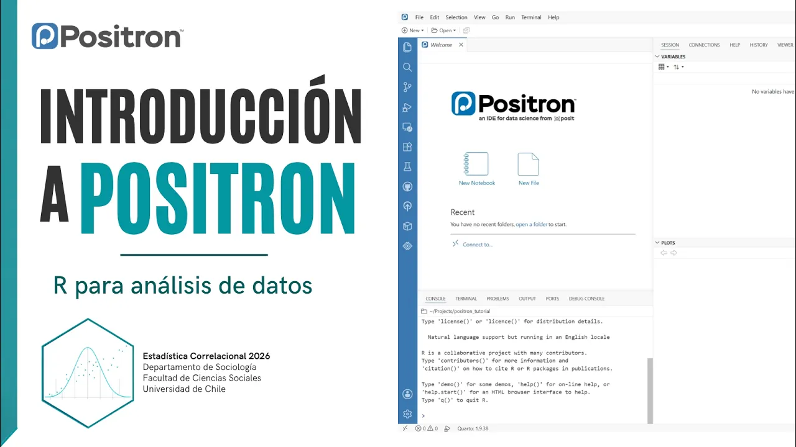

```{=html}
<style>
#title-block-header,
.quarto-title-block,
.quarto-title,
.quarto-title-meta,
.quarto-title-meta-heading,
.quarto-title-meta-contents,
.quarto-categories,
.quarto-category,
.description {
  display: none !important;
}

#quarto-content,
main.content,
.page-layout-full main {
  padding-top: 0 !important;
  margin-top: 0 !important;
}

.positron-video {
  width: 100%;
  max-width: 960px;
  margin: 1.75rem auto 0.75rem;
}

.positron-video-frame {
  position: relative;
  width: 100%;
  aspect-ratio: 16 / 9;
  overflow: hidden;
  border-radius: 14px;
}

.positron-video-frame iframe {
  width: 100%;
  height: 100%;
  border: 0;
  display: block;
}

.positron-video-link {
  margin-top: 0.65rem;
  text-align: right;
  font-size: 0.92rem;
}

.positron-video-link a {
  text-decoration: none;
}
</style>
```

::: {.notice-post}

::: {.notice-hero}

<div class="notice-image-wrap">

</div>

::: {.notice-meta}
<span>Preparación</span>
<span>Actividad previa</span>
<span>21 de septiembre de 2026</span>
:::

# Introducción a Positron

<p class="notice-lead">
Antes de comenzar a trabajar con Positron en las próximas clases, les dejamos este video introductorio para que puedan familiarizarse con su interfaz y con la lógica general de trabajo en este entorno.
</p>

:::

::: {.notice-body}

## Para esta semana

Estimadas y estimados estudiantes:

Como preparación para las próximas sesiones, les pedimos revisar el siguiente video de **introducción a Positron**. A partir de la próxima semana comenzaremos a utilizar este entorno para trabajar con **R** durante el curso.

**No se espera que memoricen ni dominen todas las herramientas que aparecen en el video.** La idea es simplemente que tengan una primera aproximación y que, cuando comencemos a utilizar Positron en clases y laboratorios, algunos elementos de la interfaz ya les resulten familiares.

Al finalizar el video, deberían poder reconocer de manera general:

- la interfaz de Positron;
- dónde podemos escribir y ejecutar código;
- dónde aparecen los resultados;
- cuáles son los principales paneles del entorno;
- cómo se organiza, a grandes rasgos, el trabajo con R dentro de Positron.

## Video: Introducción a Positron

<div class="positron-video">
  <div class="positron-video-frame">
    <iframe
      src="https://www.youtube.com/embed/APkZlRjBrfI"
      title="Introducción a Positron | Estadística Correlacional 2026"
      allow="accelerometer; autoplay; clipboard-write; encrypted-media; gyroscope; picture-in-picture; web-share"
      referrerpolicy="strict-origin-when-cross-origin"
      allowfullscreen>
    </iframe>
  </div>

  <div class="positron-video-link">
    <a href="https://www.youtube.com/watch?v=APkZlRjBrfI" target="_blank" rel="noopener noreferrer">
      Ver video directamente en YouTube ↗
    </a>
  </div>
</div>

::: {.notice-list-card}

**Para la próxima clase**

Revisa el video completo antes de la próxima sesión. **No necesitas aprender todo de memoria:** la finalidad es que llegues con una primera familiarización con Positron.

Desde la próxima semana comenzaremos a utilizarlo en las actividades del curso y aprenderemos progresivamente a trabajar con sus distintas herramientas durante las clases y laboratorios.

:::

:::

:::